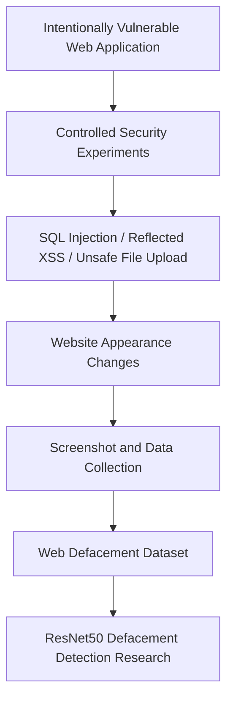
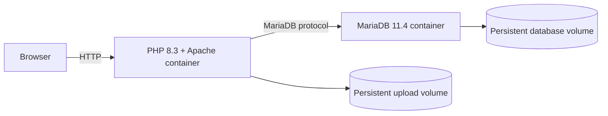

# Web Defaced Attack

Web Defaced Attack is an intentionally vulnerable PHP web application created as part of an academic cybersecurity project for controlled website-defacement experiments and research data collection.

## Live Demo

**Official demo:** [https://webdeface.nniisworking1606.id.vn/](https://webdeface.nniisworking1606.id.vn/)

Visitors may use this explicitly provided instance to explore the intentionally vulnerable application in the environment prepared for this project. The demo is intended only for education and controlled testing. Testing must remain limited to this demo environment; never apply the demonstrated techniques to third-party systems without explicit authorization.

## Security Notice

> [!WARNING]
> This application is intentionally insecure. Run your own deployment only in an isolated lab, a controlled local network, or another environment with appropriate safeguards. Do not expose a self-hosted instance directly to the public internet. This project is intended solely for education, academic research, and authorized cybersecurity experiments.

## Overview

The application provides a compact and reproducible target for observing how common web vulnerabilities can alter a website's content or appearance. It was developed to support controlled experiments, screenshot capture, and data collection for research into automated website-defacement detection.

The repository focuses on the vulnerable web application and its Docker environment. Dataset files, machine-learning notebooks, and trained models belong to a separate research project and are not required to run this application.

## Research Purpose

This project acts as the data-generation and security-lab component of a larger website-defacement detection study. In an isolated environment, selected vulnerabilities can be reproduced, their visual effects observed, and screenshots or related research data collected. That data can then support a separate ResNet50-based classification workflow.

The goal is to study defensive detection in a repeatable academic setting—not to provide instructions for compromising real systems.

## Vulnerabilities Demonstrated

### SQL Injection

The login implementation intentionally constructs a database query from untrusted input without parameterized statements. In the controlled lab, this behavior was used to demonstrate how unsafe query construction can affect authentication. No attack payloads are documented here.

### Cross-Site Scripting (XSS)

The search page intentionally reflects submitted text without proper output encoding. This allows researchers to observe, within the authorized lab, how injected client-side content can change the appearance or content of a rendered page.

### Unrestricted File Upload

The upload page intentionally stores submitted files without adequate extension, MIME-type, or content validation. It exists to study the risks and visible effects of unsafe upload handling in an isolated environment. Do not use it to upload harmful content or test systems outside the authorized project environment.

## Research Workflow



## Features

- Basic username and password login backed by MariaDB
- Search page with intentionally reflected user input
- File-upload page with intentionally insufficient validation
- Simple dashboard for the laboratory application
- Database initialization from the existing `setup.sql` file
- Dockerized PHP/Apache and MariaDB services
- Health checks, restart policies, and persistent database/upload storage
- Environment-based application and database configuration

## Tech Stack

- PHP 8.3 with the `mysqli` extension
- Apache HTTP Server
- MariaDB 11.4
- HTML and CSS
- Docker
- Docker Compose

## Architecture



Docker Compose places the application and database on the same internal network. The PHP application connects to MariaDB through the `db` service name rather than `localhost`.

## Project Structure

```text
.
├── index.php          # Login page and intentionally unsafe login query
├── dashboard.php      # Application dashboard
├── search.php         # Search page used for the reflected-XSS demonstration
├── upload.php         # Intentionally unrestricted upload page
├── db_config.php      # Primary environment-aware database connection
├── config.php         # Compatible alternate database configuration
├── setup.sql          # MariaDB schema and initial sample record
├── Dockerfile         # PHP 8.3 and Apache application image
├── compose.yaml       # Application, database, health checks, and volumes
├── .env.example       # Safe configuration template
├── .dockerignore      # Excludes secrets and research/large files from builds
└── uploads/           # Local upload directory outside the container workflow
```

The deployable application does not depend on datasets, notebooks, or model files. The Docker build explicitly excludes local research artifacts and generated content.

## Getting Started with Docker

### Prerequisites

- Docker Engine
- Docker Compose v2 (`docker compose`)
- Git

### Clone and configure

```bash
git clone https://github.com/Nhat22-archlinux/Web_Defaced_Attack.git
cd Web_Defaced_Attack
cp .env.example .env
chmod 600 .env
```

Edit `.env` and replace every placeholder secret before starting the services. Do not commit this file.

### Build and start

```bash
docker compose up -d --build
docker compose ps
```

Open the application using the configured values:

```text
http://<APP_BIND_ADDRESS>:<APP_PORT>
```

Use `sudo docker compose ...` if the local Docker installation requires elevated privileges.

## Environment Variables

Create `.env` from `.env.example`. The real `.env` file is intentionally ignored and its values must remain private.

| Variable | Purpose |
| --- | --- |
| `APP_BIND_ADDRESS` | Host interface on which the web application is published |
| `APP_PORT` | Host port mapped to Apache inside the application container |
| `DB_NAME` | MariaDB database name used by both services |
| `DB_USER` | Application database user |
| `DB_PASSWORD` | Password for the application database user; replace the template value |
| `DB_ROOT_PASSWORD` | MariaDB administrative password; replace the template value |

Docker Compose passes the database settings to PHP and sets `DB_HOST=db` and `DB_PORT=3306` within the container network.

## Database Initialization

On the first startup of a new database volume, MariaDB runs `setup.sql` from its initialization directory. The script creates the application database, creates the `users` table, and inserts the sample record required by the lab.

Database files persist in the `db_data` Docker volume, while uploaded files persist in `uploads_data`. Because initialization scripts run only when MariaDB creates an empty data directory, editing `setup.sql` does not reinitialize an existing volume.

> [!CAUTION]
> Removing volumes deletes persistent database or upload data. Back up anything important before using volume-removal commands.

## Useful Docker Commands

Start the application:

```bash
docker compose up -d
```

Stop and remove the containers and network while preserving named volumes:

```bash
docker compose down
```

Rebuild after application or Docker configuration changes:

```bash
docker compose up -d --build
```

View service status:

```bash
docker compose ps
```

Follow logs from all services:

```bash
docker compose logs -f
```

View logs for one service:

```bash
docker compose logs -f app
docker compose logs -f db
```

Update the application from the configured Git remote and rebuild:

```bash
git pull
docker compose up -d --build
```

## Related Project

This repository is the vulnerable application and controlled data-generation environment for a broader website-defacement detection project. The resulting dataset and the ResNet50 notebooks, training workflow, and model artifacts are maintained separately so this repository remains focused on the PHP application and reproducible Docker laboratory.

A link is not included because no separate machine-learning repository URL is configured in this repository.

## Disclaimer

This software is provided for educational use, academic research, and explicitly authorized security testing only. Operate it in a controlled environment, protect any collected data, and comply with applicable laws, institutional rules, and authorization boundaries. The techniques represented by this application must never be used against third-party systems without explicit permission.
